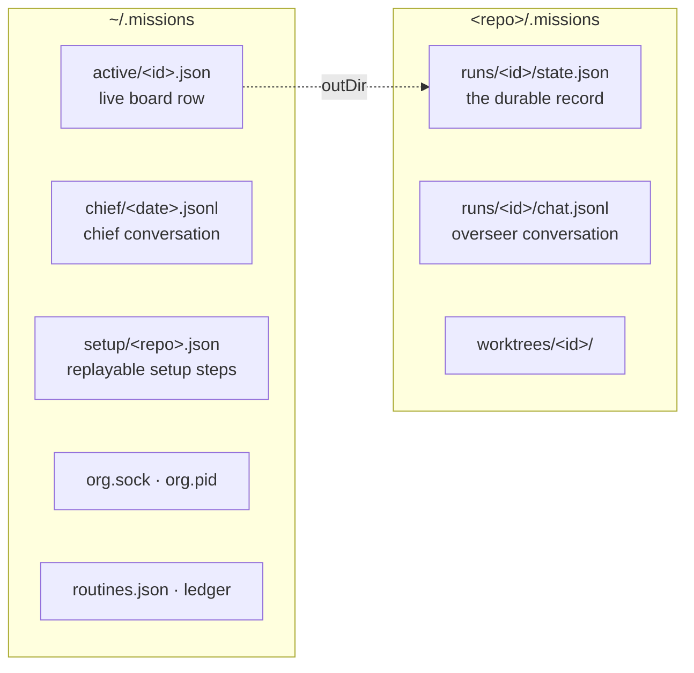

# Architecture

Missions is an engineering org you run from a terminal or a phone. One long-lived
process (the daemon) holds a chief-of-staff agent; missions run as background jobs,
each in its own git worktree; everything anyone reads comes out of one registry on
disk.

---

## 1. The system

Three kinds of thing: **processes** that run agents, **surfaces** you look at, and
**state on disk** that is the only thing they share.

```mermaid
flowchart TB
  subgraph surfaces["Surfaces — what you look at"]
    TUI["missions chat<br/>TUI · control.ts"]
    WEB["web console<br/>Next.js · phone + laptop"]
    RPT["report.html<br/>per mission"]
  end

  subgraph procs["Processes — where agents run"]
    D["daemon<br/>chief-of-staff agent<br/>chief.ts"]
    R["MissionRunner<br/>cap 3, parallel<br/>chief.ts"]
    M["runMission<br/>one per mission<br/>mission.ts"]
    O["overseer<br/>one per mission, on demand<br/>overseer.ts"]
  end

  subgraph disk["State — ~/.missions and the repo"]
    REG[("active/*.json<br/>registry.ts")]
    RUN[("runs/&lt;id&gt;/state.json<br/>+ chat.jsonl")]
    CL[("chief/YYYY-MM-DD.jsonl<br/>chieflog.ts")]
    WT[("repo/.missions/worktrees/&lt;id&gt;")]
  end

  TUI <-->|"unix socket<br/>ipc.ts"| D
  WEB <-->|"same socket, read-only attach"| D
  D --> R --> M
  M -->|"publishes on every log line"| REG
  M --> RUN
  M --> WT
  D --> CL
  WEB --> REG
  WEB --> RUN
  WEB --> O
  TUI --> O
  O -->|"live ask / steer"| M
  M --> RPT

  style D fill:#12233a,stroke:#5aa9d6
  style REG fill:#1a1a24,stroke:#7d6cc4
```

Two rules hold this together:

- **The registry is the only shared truth.** The TUI, the console and the board all
  read `~/.missions/active/*.json`. Nothing reimplements "what does succeeded mean".
- **The socket carries conversation, not data.** Attaching is read-only by design —
  a client that sent `hello` would call `setFocus`, and focus is global, so a phone
  opening a page would yank the focus out from under a terminal.

---

## 2. One mission, start to finish

The loop is: work the queue → validate the **whole** contract → let the orchestrator
rule the boundary. Validation failing on the first pass is the normal case, not the
error case.

```mermaid
flowchart TD
  S["dispatch<br/>goal + RFC"] --> W["git worktree add<br/>own branch, own tree"]
  W --> B["bootstrap<br/>copy .env — secrets are the<br/>one thing no install recreates"]
  B --> SU["stage 0: setup<br/>replay recorded steps, or an agent<br/>that fixes the repo's setup doc"]
  SU --> P["ports<br/>10-port block from<br/>sha256(worktree path)"]
  P --> PL["plan<br/>features + validation contract<br/>written BEFORE any code"]
  PL --> G{"plan passes<br/>harness invariants?"}
  G -->|no| X["abort — a contract that<br/>coerced to nothing scores 0/0,<br/>and 0/0 reads as CLEAN"]
  G -->|yes| DB["branch the database<br/>only if the plan does DDL"]

  DB --> ML["milestone m"]
  ML --> WK["worker per feature<br/>→ commit"]
  WK --> V["validate the WHOLE contract<br/>+ adversarial bug spotter"]
  V --> BD{"boundary ruling"}
  BD -->|"contract satisfied,<br/>issues ruled"| PASS["PASSED"]
  BD -->|"corrections scoped"| ML
  BD -->|"no corrections offered,<br/>or invariants blocked"| STALL["STALLED — needs you"]
  BD -->|"budget / milestone ceiling"| STOP["stopped short"]

  PASS --> RP["report + diagrams"]
  STALL --> RP
  STOP --> RP

  style X fill:#3a1416,stroke:#e5484d
  style STALL fill:#3a2a12,stroke:#d08b28
  style PASS fill:#1a1a24,stroke:#7d6cc4
```

### Why each isolation step exists

| Step | Without it |
|---|---|
| worktree + branch | two missions edit the same files |
| copy `.env`, don't symlink | dotenv loads with `override=True`, so a shared file beats any value the harness injects |
| setup installs, never inherits | a mission that changes a lockfile can never test its own change |
| per-worktree port block | both bind `PORT=3000`; the second fails, the smoke check hits the *first* mission's server, and validation passes against code this mission never wrote |
| database branch on DDL only | schema work is the one action that breaks every other tree at once |

---

## 3. Who does what

Seats are real agents with real budgets, not labels.

```mermaid
flowchart LR
  CH["chief<br/>runs the org, dispatches,<br/>merges"] --> LD["lead / orchestrator<br/>plans, writes the contract,<br/>rules each boundary"]
  LD --> EN["eng / worker<br/>implements against<br/>the contract"]
  EN --> QA["qa / bugSpotter<br/>proves or disproves,<br/>adversarially"]
  QA --> LD
  SE["setup<br/>makes a fresh tree runnable,<br/>fixes the repo's setup doc"] -.-> EN
  OV["overseer<br/>answers questions about<br/>ONE mission"] -.->|"ask / steer"| EN

  style QA fill:#3a2a12,stroke:#d08b28
```

`bugSpotter` is deliberately routed to a different provider than `worker` where
possible — an adversarial reviewer sharing the implementer's blind spots is not a
reviewer. Seats are recorded on every timeline event (`src/seats.ts`), so the mission
thread reads as a conversation rather than a list of harness kinds.

---

## 4. Where state lives

Everything append-only or rewritten whole; nothing needs a database. Chat logs are
JSONL in daily or per-mission segments so retention is `rm`, not a migration.

---

## 5. Surfaces

| Surface | Command | Good for |
|---|---|---|
| TUI | `missions chat` | dispatching, steering, living in it |
| board | `missions board` | one glance, all repos |
| console | `web/` on `:3200` | phone, reviewing a mission, asking the overseer |
| report | written per mission | the durable artifact, diagrams included |

Selected CLI verbs: `run` · `chat` · `attach` · `board` · `status` · `view` · `peek` ·
`stop` · `standup` · `brief` · `changelog` · `repos` · `routine` · `gc` · `forget`.

---

## 6. Known sharp edges

- **Concurrency cap is global** (`cap = 3` in `MissionRunner`), but contention is
  per-repo. Three missions in one repo and none anywhere else is the same budget as
  one each in three repos.
- **Shared symlinked dependencies** are protected by prompt text, not by the
  `spawnHook` that could enforce it.
- **A mission killed mid-run** never writes a terminal status. `isLive`/`isStalled`
  in `registry.ts` decide this by staleness (1 hour) rather than trusting the field.
- **Ports collide across allocations in the same instant** — the claim is published
  one file-write after it is chosen. Narrow, and a lock costs more than it saves.
